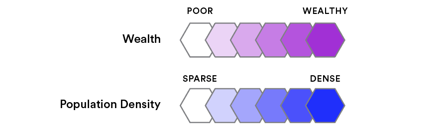
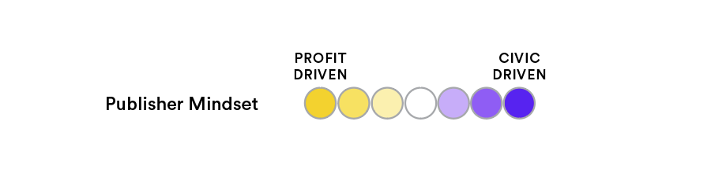

# Model Documentation

## Purpose

This model is meant to explore the interactions of news publisher revenue, social media platforms, advertising markets, news coverage, and news deserts.

Its goals are to:

- Reproduce observed real-world effects, including:
    - Decline in advertising revenue as a result of advertisers shifting from publishers to platforms;
    - Systematic biases in news coverage motivated by advertising revenue concerns;
    - Collapse and consolidation of local papers due to declines in advertising revenue;
    - Expansion of news deserts as a result of local papers collapsing.
- To provide a way to explore possible interventions and explore counterfactual ("what-if") scenarios.

## Limitations

- _Complexity limits_: All models are simplifications. Our aim is to highlight parts of a system we are especially interested in and develop a tool that allows us to ask questions about that part. The more details we add, the more complicated the model becomes, and it can be harder to clearly understand how it works. Complex models also are computationally harder to run and trickier to develop, debug, and tune.
- _Specificity limits_: This model is meant to explore the above dynamics in a _general_ way. That is, we are not looking at a specific or real-world place and publishers. We are instead developing a theory that we believe will be applicable across many specific cases. There are also practical reasons for these limits: the data we need for specificity might not be available, it might be expensive, or it might require a lot of manual cleaning and processing.
- _Epistemological limits_: All models require assumptions to build, and unfortunately we can never know for certain that the resulting model is "correct". This is a fundamental limitation of modeling in general. The best we can hope for is that if the model recreates observed behaviors then we have reason to believe the interventions in the model will see similar effects in the real world. If this appears to be the case then we have more confidence in the model. But we can never guarantee that a model is 100% reliable.

All models involve these limitations, but they are nonetheless useful.

## Specification

_Note_: Text formatted `like this` indicate a parameter that can be adjusted. These are basically variables that let users of the model insert their own assumptions. See the "Parameters" section below for more details.

The model consists of a hexagonal grid world. Each hexagon (_cell_) has a _population_ and average _wealth_ that are randomly generated.

    
Reset

    

        

        

    

### Publishers

_Publishers_ are also generated randomly; a cell's likelihood of having a publisher is determined by its population and wealth. More densely-populated and wealthier cells are more likely to have publishers.

    
Reset

    

        

        

    

Publishers also have a _coverage area_ that determines what cells they might report on. This is also determined by the cell population: publishers in more densely-populated cells are more likely to have a wider coverage area. This is meant to emulate how the publishers that cover the most area (for example, national publications) tend to be located in large cities.

Publishers have a starting amount of _funds_ that is determined by the `baseFunds` parameter and the population of their cell. Publishers in more densely-populated cells will tend to have more starting funds.

Publishers also each have an _owner_. Every publisher starts out owned by a different owner. Owners capture some of the publishers' revenue, determined by the `ownerRevenueShare` parameter. They can use this money to purchase other publishers.

Owners also have different _motives_. They are all motivated by some randomly-generated mixture of _civic-drive_ and _profit-drive_. All publishers under a given owner share that owner's motivations. Thus some publishers lean more towards profit and some lean more towards civic duty. These influence how publishers decide on what to report on.

### Events

Every time step in the model, _events_ happen in cells. The number of events that happen depends on the cell's population, such that more densely-populated cells tend to have more events. Publishers decide whether or not to cover these events.

Reporting on events has a _cost_, determined by the `baseCost` parameter and the event cell's population, such that more densely-populated cells are more costly to cover.

For each event, a publisher asks: "What do I get out of reporting on this event?" The answer is determined by their motives. More _profit-motivated_ publishers emphasize the expected ad profit, which is determined by the wealth of the cell the event occurred in and the reporting costs. Thus they are more likely to cover events in wealthier areas. More _civic-motivated_ publishers, on the other hand, emphasize covering events that affect a lot of people.

    

        

        

        

    

    

        Civic-motive <input type="range" min="0" max="1" step="0.1" id="motive"> Profit-motive
        
--

    

### Platforms

Media platforms exponentially gain new users, as determined by the `platformGrowth` parameter. Platforms also accumulate _data_ from their users, as determined by the `dataPerUser` parameter. This data makes platforms appealing to advertisers.

### Advertising

Advertising revenue from a cell is determined by the `revenuePerAd` parameter, the overall health of the economy (via the `economy` parameter), platforms' data, and the cell's wealth and population.

A publisher takes a share of a cell's advertising revenue only if they covered that cell's events.

Advertising revenue is diverted towards platforms as they accumulate data.

### Subscriptions

Subscription revenue from a cell is determined by the `revenuePerSub` parameter, the overall health of the economy (via the `economy` parameter), and the cell's wealth and population.

A publisher gets subscription revenue from a cell only if they covered that cell's events.

### Bankruptcy and Consolidation

Publishers may go bankrupt if their funds drop below zero.

Profit-motivated owners may also buy publishers with their own funds. The price of a publisher is determined by the funds it has on hand and the `valuationMultiplier` parameter. Once a publisher is acquired by a new owner, it adopts the motivations of that new owner. Thus it might become more civic or profit-motivated, depending on the new owner.

Owners can't own more publishers than set by the `ownershipLimit` parameter.

### Parameters

Parameters are variables that represent some of the assumptions we are making with the model. They provide a way for people to make their own assumptions and a way to explore different "what-if" scenarios.

In this model, the primary parameters are:

- `baseFunds`: publishers start out with this much money plus more based on their population
- `baseCost`: how much it costs at minimum to report on something.
- `dataPerUser`: how quickly social media platforms accumulate data, which makes them more appealing to advertisers
- `revenuePerAd`: how much revenue publishers make per ad sale
- `revenuePerSub`: how much revenue publishers make per subscriber
- `platformGrowth`: how quickly social media platforms grow in users
- `ownerRevenueShare`: how much publisher revenue goes to the owner
- `valuationMultiplier`: influences the cost of buying a publisher
- `ownershipLimit`: maximum amount of consolidation allowed
- `economy`: general economic health multiplier

## Questions

These are some example questions to demonstrate what the model can do.

- What happens to coverage if ownership limits were increased or reduced?
- What happens to coverage if we subsidize small local papers?
- What happens if subscriber revenue is somehow increased? How much does it have to increase by to make up for the loss in advertising revenue?
- What if we redistribute some of the advertising revenue from platforms back to publishers?
- What happens if all publishers are entirely civic-driven? If profit-driven?
- What if some percent of owner revenue is put into a common fund to support smaller papers?

## Technical Details

Cell populations ¦p_c \in [0.1, 1]¦ and wealth ¦w_c \in [0.1, 1]¦ are initialized using 2D simplex noise to provide a smooth distribution over the hexagonal space.

A publisher is created in a cell ¦c¦ with probability ¦\frac{p_c^2 + w_c^2}{2}¦. A publisher's radius is defined as ¦r s p_c¦ where ¦r \in [0,1]¦ is a uniform random variable and ¦s¦ is the largest dimension of the hexagonal grid (i.e. number of columns or rows, depending on which is greater). A publisher's funds ¦f_p¦ start as ¦\beta p_c (1 + w_c)¦, where ¦\beta¦ is the `baseFunds` parameter. A publisher's owner's civic motive weight ¦m_v¦ is initialized as a uniform random variable ¦m_v \in [0,1]¦; the profit motive weight is ¦m_p = 1 - m_v¦.

Each step, events are generated in a cell ¦c¦ according to a Poisson distribution parameterized by ¦\lambda = p_c¦. Publishers decide what events to report on by ranking events according to a reward function ¦\mathcal R¦. For an event ¦e_c¦ in cell ¦c¦, the reward function is ¦\mathcal R(e_c) = m_v p_c + m_p (p_c w_c - c_e)¦, where ¦c_e¦ is the cost of reporting on event ¦e = \kappa + \sqrt{p_c}¦ and ¦\kappa¦ is the parameter `baseCost`. Publishers run down this ranking of events, reporting everything until they run out of funds for the step.

Total advertising revenue ¦r^a_c¦for a cell ¦c¦ is determined by ¦r^a_c = \eta_a w_c p_c \epsilon¦ where ¦\eta_a¦ is the `revenuePerAd` parameter and ¦\epsilon¦ is the `economy` parameter. If we say ¦P_{e_c}¦ is the set of publishers that covered event ¦e_c¦ and ¦d¦ is the platforms' accumulated data, the advertising revenue per publisher covering that cell is:

$$
r^a_{c,p} = \begin{cases}
\frac{r^a_c}{|P_{e_c}| + d} & \text{if } p \in P_{e_c} \\
0. & \text{otherwise}
\end{cases}
$$

Similarly, subscription revenue for a publisher covering that cell is as follows, where ¦\eta_b¦ is the `revenuePerSub` parameter:

$$
r^b_{c,p} = \begin{cases}
\eta_b \epsilon \frac{p_c w_c}{|P_{e_c}|} & \text{if } p \in P_{e_c} \\
0. & \text{otherwise}
\end{cases}
$$

The publisher takes revenue of ¦(1-\omega)(r^a_{c,p} + r^b_{c,p})¦, where ¦\omega¦ is the `ownerRevenueShare` parameter.

Platform users ¦u¦ grows at the rate of ¦u^\gamma¦ per step, up to a maximum of ¦\sum_{c \in C}p_c¦ (i.e. the total population), where ¦\gamma¦ is the `platformGrowth` parameter and ¦C¦ is the set of all cells. Platform data ¦d¦ increases by ¦u^2 \delta¦ per step, where ¦\delta¦ is the `dataPerUser` parameter.

A publisher goes bankrupt if it ends the step with ¦f_p < 0¦.

Owners where ¦m_p > m_v¦ (i.e. more profit-motivated than civic-motivated) may purchase more publishers, so long as the percent of publishers they own is less than the `ownershipLimit` parameter. The cost of a publisher ¦p¦ is ¦f_p \upsilon \epsilon¦ where ¦\upsilon¦ is the `valuationMultiplier` parameter. To buy, the interested owner must have enough funds for this cost.

